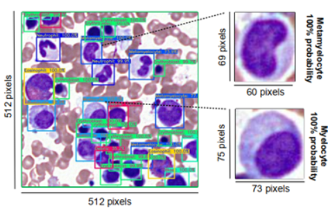
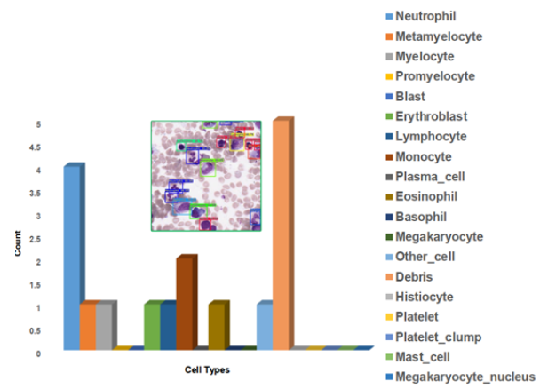

# Cytology Work - "ROI Detection" and "Cell Detection and Classification" in bone marrow cytology.
### Paper Abstract
Bone marrow cytology is required to make a hematological diagnosis, influencing critical clinical decision
points in hematology. However, bone marrow cytology is tedious, limited to experienced reference centers and
associated with high inter-observer variability. This may lead to a delayed or incorrect diagnosis, leaving an
unmet need for innovative supporting technologies. We have developed the first ever end-to-end deep learningbased technology for automated bone marrow cytology. Starting with a bone marrow aspirate digital whole
slide image, our technology rapidly and automatically detects suitable regions for cytology, and subsequently
identifies and classifies all bone marrow cells in each region. This collective cytomorphological information is
captured in a novel representation called Histogram of Cell Types (HCT) quantifying bone marrow cell class
probability distribution and acting as a cytological “patient fingerprint”. The approach achieves high accuracy
in region detection (0.97 accuracy and 0.99 ROC AUC), and cell detection and cell classification (0.75 mAP,
0.78 F1-score, Log-average miss rate of 0.31). HCT has potential to revolutionize hematopathology diagnostic
workflows, leading to more cost-effective, accurate diagnosis and opening the door to precision medicine.

[See images source at Kimia Lab](https://kimialab.uwaterloo.ca/kimia/index.php/roi-detection-and-cell-detection-and-classification-in-bone-marrow-cytology/)
### Useful Links
- [Read the paper](https://arxiv.org/pdf/2107.02293.pdf)
- [Learn more on Kimia Lab](https://kimialab.uwaterloo.ca/kimia/index.php/roi-detection-and-cell-detection-and-classification-in-bone-marrow-cytology/)

### Disclaimer
Rhazes Lab does not own the code in this repository. This code and data were produced in Kimia Lab at the University of Waterloo. The code is provided as-is without any guarantees, and is stored here as part of Kimia Lab's history. We welcome questions and comments.

Before using or cloning this repository, please read the [End User Agreement](agreement.pdf).
